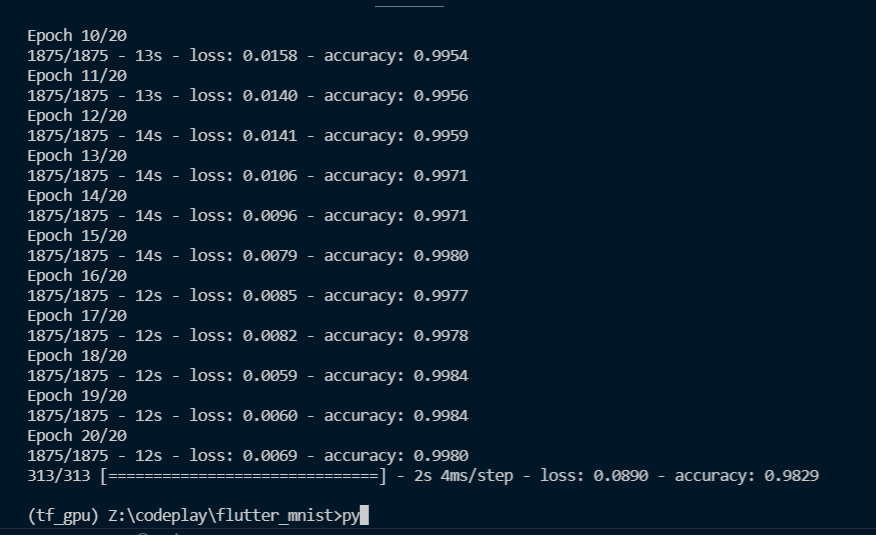
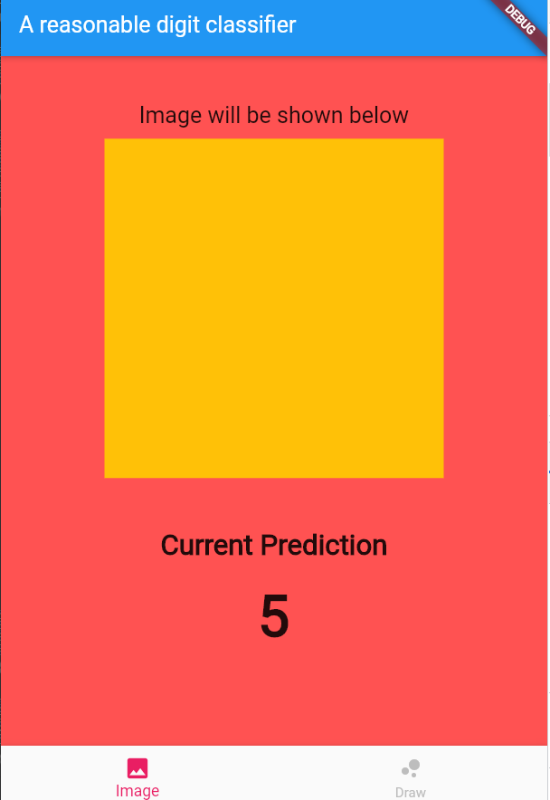

# Machine learning apps with flutter
from [Alladin Perrson](https://www.youtube.com/watch?v=Yla6MqEePh8)

had to install tensorflow with gpu for this. `tf_gpu`

### errors
ERROR: pip's dependency resolver does not currently take into account all the packages that are installed. This behaviour is the source of the following dependency conflicts.
tensorflow 2.5.0 requires keras>=2.4.0, which is not installed.
tensorboard 2.5.0 requires tensorboard-data-server<0.7.0,>=0.6.0, which is not installed.
tensorflow 2.5.0 requires flatbuffers~=1.12, but you have flatbuffers 20210226132247 which is incompatible.
tensorflow 2.5.0 requires grpcio~=1.34.0, but you have grpcio 1.36.1 which is incompatible.

## training model

main.py for training

## creating flutter app

need to create flutter

## Created basic app

1. dependencies install.bat needs to be installed
2. basic layout:

